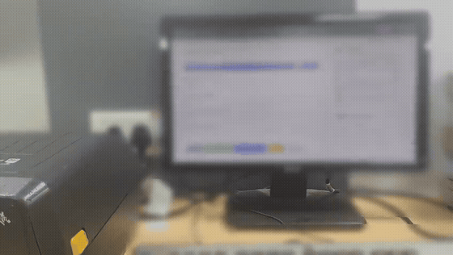
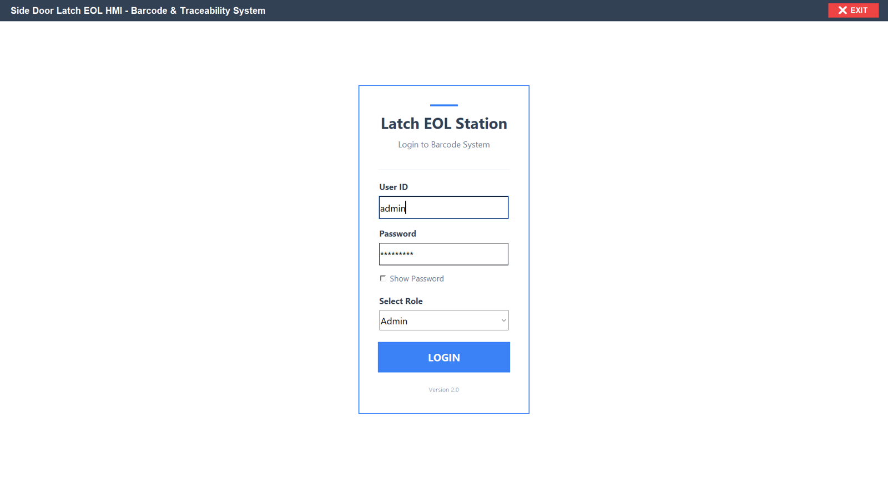
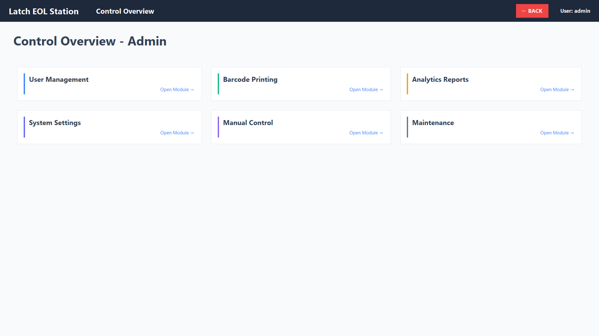
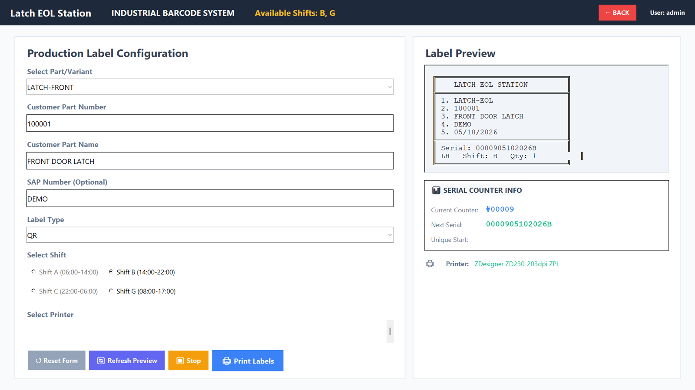
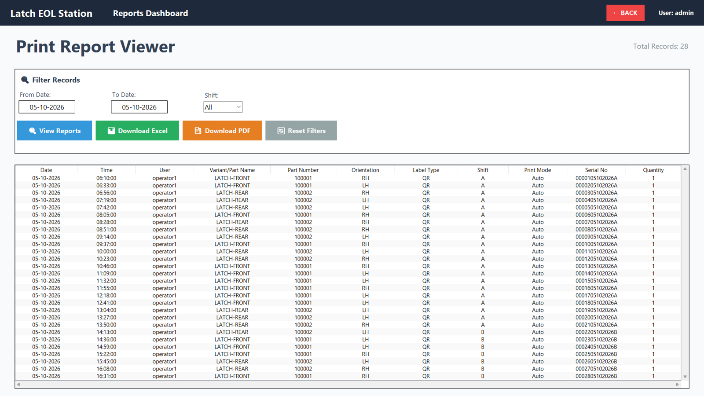
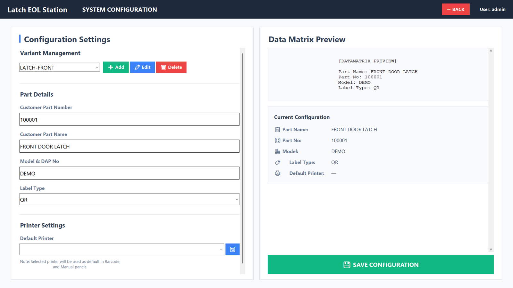
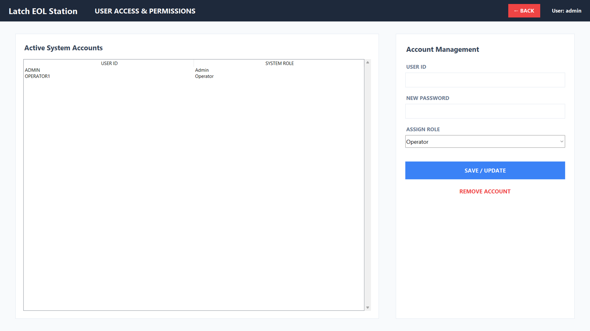

# Side Door Latch End-of-Line Validation System: HMI & Barcode Traceability

**An operator HMI and barcode/QR traceability module for an automated end-of-line (EOL) test machine for automotive side door latches.** The PLC-controlled machine validates each latch: functionality, engagement, release and auto-canceling operation. This Python HMI then generates and prints a unique traceability label for each validated part, and keeps a full print log and shift-wise reports.


> **Result:** replacing manual label writing and data entry with automated label generation reduced manual data-entry errors by about **90%**, and gives every latch an accurate, traceable serial number.

---

## Working Demonstration



[▶ Watch the full demo video](media/demo.mp4): login, configuring a part variant, label preview, printing QR traceability labels on the Zebra label printer, reports and user administration.

> The screen is blurred in the video to hide the customer's name. The screenshots below show the same HMI with neutral demo data.

| Login | Control overview | Label printing |
|---|---|---|
|  |  |  |
| **Print reports** | **System configuration** | **User management** |
|  |  |  |

---

## System overview

```
┌──────────────────────────────┐        ┌──────────────────────────────┐        ┌───────────────────┐
│  EOL test machine (PLC)      │  pass  │  Operator HMI (this project) │  ZPL   │ Zebra label       │
│  • functionality test        │ ─────► │  • variant / LH-RH / shift   │ ─────► │ printer           │
│  • engagement test           │        │  • serial number generation  │        │ QR + text label   │
│  • release test              │        │  • QR label preview & print  │        └───────────────────┘
│  • auto-canceling test       │        │  • print log & reports       │
└──────────────────────────────┘        └──────────────────────────────┘
```

- **PLC (test machine):** runs the latch test sequence and decides pass/fail. The PLC program isn't part of this repository.
- **HMI (this repository):** used by the operator at the end of the line. For every validated latch it generates a unique serial number and prints the traceability label, then records the print in a log for reports and audits.

## HMI features

- **Role-based login:** Admin, Supervisor, Operator and Maintenance. An editable permission matrix controls which screens each role can open.
- **Production label printing:**
  - Select the part variant. Part number, part name and model are filled in from configuration.
  - Choose the side (LH / RH / BOTH), the shift and the quantity.
  - A live label preview is shown before printing.
- **Automatic serial numbers:** format `NNNNN DDMMYYYY S`, for example `0000905102026B`. That's a 5-digit counter per variant, side and shift, then the date and the shift letter. Counters persist between sessions.
- **Shift awareness:** shifts A, B, C and G are enabled automatically from the current time.
- **Direct Zebra printing:**
  - The HMI builds ZPL itself: a QR code holding part number + serial, a vertical LH/RH indicator, and up to 5 text lines.
  - It sends the ZPL as a RAW print job through the Windows spooler (`win32print`), so no label-design software is needed.
- **Manual print panel:** for re-prints or a manual serial start, with permission control.
- **Reports:** filter the print log by date range and shift, then export to **Excel** (openpyxl) or **PDF** (reportlab).
- **Configuration screen:** add, edit or delete variants and part details, and set the label type and default printer.
- **User management:** add, update or remove accounts and assign roles.
- **Shop-floor UI:** full-screen layout with large buttons and a clear navigation bar. It runs from a Python script or a single-file `.exe`.

More detail is in [docs/system_overview.md](docs/system_overview.md).

## Tech stack

Python 3 · PyQt · Pillow · reportlab · openpyxl · pywin32 (`win32print`) · ZPL · PyInstaller

## Source code

The source code is kept in a **private repository**. It is available to recruiters and interviewers on request: contact me via [GitHub @dhanushanand-dev](https://github.com/dhanushanand-dev).

This public repository is a showcase. It contains the README, the [system overview](docs/system_overview.md) and the demo media (`media/`).

The private source repository is laid out like this:

```
├── latch_eol_hmi.py          # the HMI application
├── system_config.json        # part variants, label types, shifts (sample data)
├── permissions.json          # role → allowed screens
├── users.example.json        # sample accounts
├── requirements.txt
├── launcher.bat              # start the HMI
├── build_exe.bat, latch_eol_hmi.spec   # PyInstaller build
├── docs/system_overview.md
└── media/                    # demo video, GIF, screenshots
```

It runs on Windows with Python 3 (`pip install -r requirements.txt`, then `python latch_eol_hmi.py`), or as a single-file `.exe` built with PyInstaller.

## Skills demonstrated

- Industrial HMI design for the shop floor (Python / PyQt)
- Barcode and QR traceability: serial number scheme, label layout, ZPL programming, raw printing to Zebra printers
- Integration of an operator station with a PLC-controlled end-of-line test machine
- Role-based access control and configuration management with JSON
- Production reporting: CSV logging, Excel and PDF export
- Packaging a Windows desktop app with PyInstaller

## Notes and limitations

- The latch test sequence runs on the PLC. This HMI handles operator control, label generation and traceability. It doesn't read test results from the PLC directly.
- The configuration offers Code128 and DataMatrix as label types, but the printer output is currently QR only.

## Author

**Dhanush Anand** · [GitHub @dhanushanand-dev](https://github.com/dhanushanand-dev)
